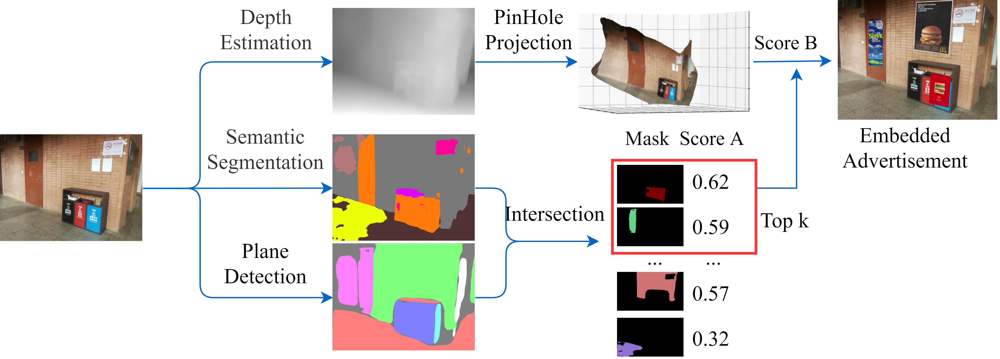

# End-to-End Texture-Aware and Depth-Aware Embedded Advertising for Videos

## Introduction

This is  a pytorch version repository of [paper](), a preprint version can be downloaded in arxiv.org(Not Uploaded): 

Use this pipeline, one can embed a rectangle-like advertisement in a video without any difficulty.

For more information, please visit our website [E2E Advertising]().

A demo can be seen [here](https://www.youtube.com/watch?v=6h5ptSp3lbY) at youtube.com.

See Github Pages for more details : https://hsungong.github.io/Augmented-Advertisement/

## Abstract

The number of online videos is increasing rapidly with the prosperity of advertising market. To dig out the immense potential of videos, there are mainly two advertising types for commercial usage, mid-roll and embedded.  Embedded advertisements, compared with mid-roll ones, is an imperceptible and brilliant strategy. However once the video is produced, the advertisement embedded in it is nonchangeable, which causes out-of-date advertisements or personalized advertising difficulty. Meanwhile, the trade-off among video webs' income, video shooters' production difficulty and video watchers' aesthetic taste remains as a challenge with previous advertising strategies. To solve the problems above, we propose a pipeline that automatically embeds advertisements in real-time into a monocular RGB video or a single RGB image. The pipeline detects a non-intrusive region with awareness of texture and depth, and overlays it with an advertisement. A corner-based tracker is built to preserve 3D shape information of the candidate region, which makes the embedded advertisement natural. The pipeline runs a shoot change detector in parallel to keep advertisement visible on the main scene.




## Requirements

```
conda env create -f cv.yml
```
Use `python 3.6` here.

## Train and Eval

```
bash run.sh --train

bash run.sh --eval
```

## Extensions

As shown in our paper, our pipeline is designed to add extensions if you want.

## License

Our repo is licensed under the MIT license (https://opensource.org/licenses/MIT).

## Issues

Open new issues to make this pipeline better.

## Reference

- sem-seg pspnet
https://github.com/CSAILVision/semantic-segmentation-pytorch
- depth megadepth
https://github.com/zhengqili/MegaDepth
- PlanarReconstruction
https://github.com/NVlabs/planercnn
